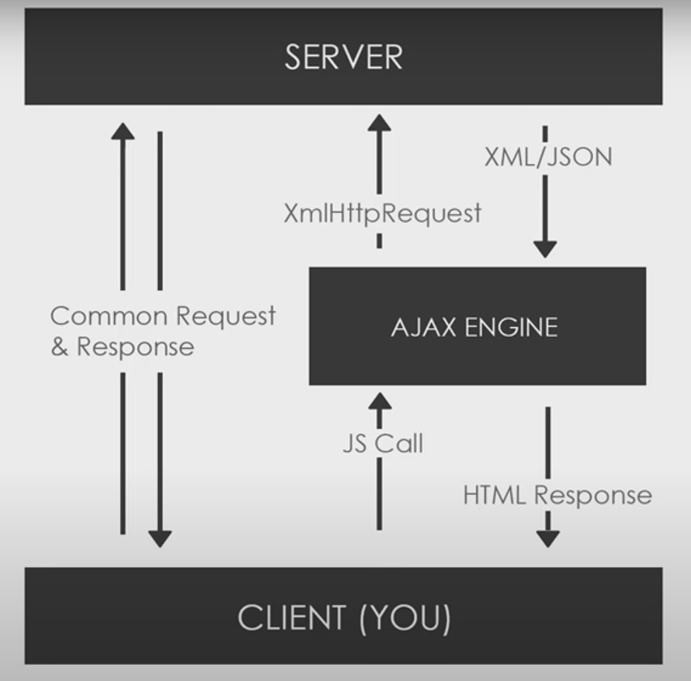

# What is AJAX?

* AJAX - Asynchronous Javascript & XML.
* Set of web technologies, not a framework or a library.
* Send and receive data asynchronously.
* Doesn't interefere with current web page.
* JSON has replaced XML for the most part.

____